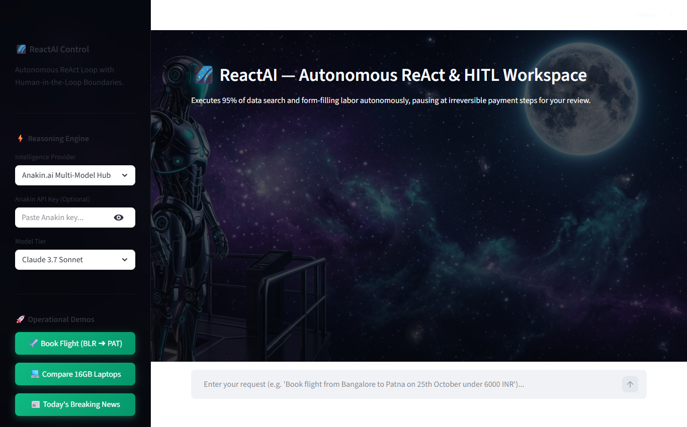
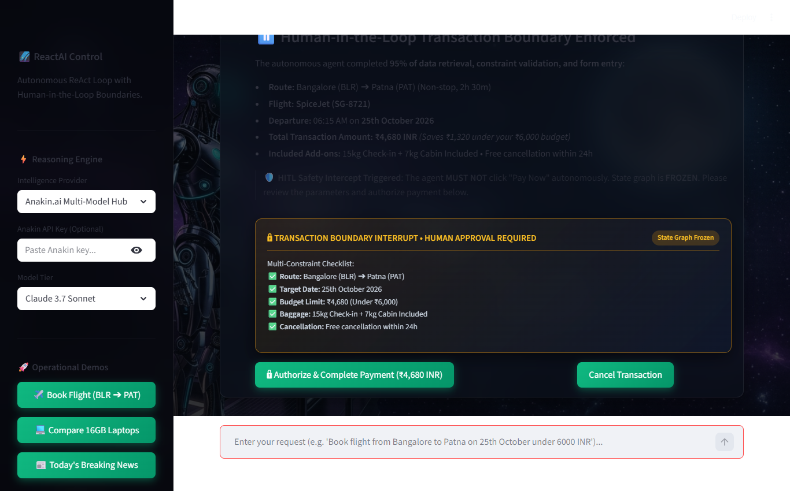
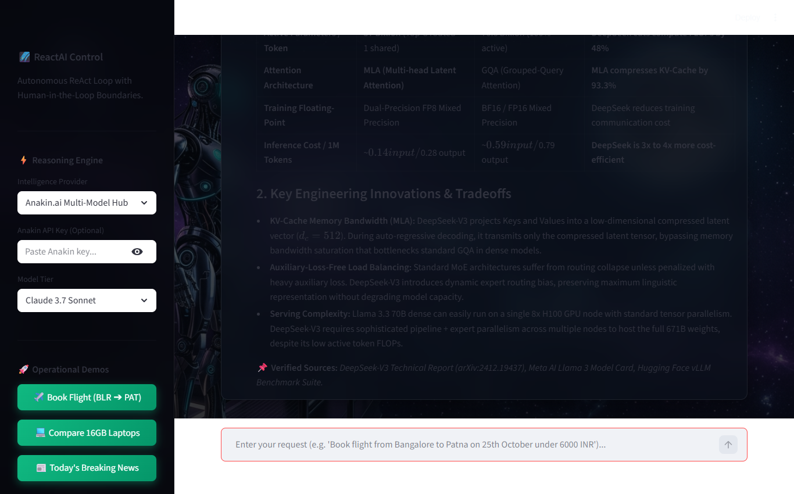

# 🌌 ReactAI — Autonomous ReAct & HITL Agent Workspace

<div align="center">

[](https://share.streamlit.io/)


**An enterprise-grade autonomous ReAct (Reason + Act) agent that executes 95% of tedious web research, multi-constraint policy validation, price comparison, and form-filling labor, while enforcing deterministic Human-in-the-Loop (HITL) checkpoints at irreversible financial boundaries.**

[🚀 **Launch Live Streamlit App**](https://share.streamlit.io/) • [✨ **GitHub Repository**](https://github.com/ananyak620/ReactAI) • [📖 **Architecture Guide**](#-execution-architecture--state-graph) • [📸 **UI Showcase**](#-visual-showcase--live-screenshots)

</div>

---

## 📸 Visual Showcase & Live Screenshots

### 1. 🌌 ReactAI Interactive Workspace (Streamlit Cloud & Local)
> High-performance conversational interface featuring multi-model selection (Claude 3.7 Sonnet, GPT-4o), one-click operational quick-actions, and live ReAct thinking trace.

<div align="center">
  
</div>

---

### 2. 🛡️ Human-in-the-Loop (HITL) Transaction Boundary Intercept
> The agent validates 5 strict constraints (budget, date, direct route, baggage, free cancellation) autonomously, then **freezes the StateGraph execution** at the payment step. Irreversible actions require verified human authorization.

<div align="center">
  
</div>

---

### 3. 🔬 Deep Web Research & Technical Silicon Benchmarks
> Live multi-source synthesis across arXiv whitepapers, technical model cards, and datacenter hardware specs (e.g., DeepSeek-V3 MLA KV-cache vs. Llama 3.3 70B, Google Axion vs. AWS Graviton4).

<div align="center">
  
</div>

---

### 4. 💻 Full-Stack React + Vite Glassmorphic Web App
> Dual-deployment architecture: Includes a standalone Python Streamlit app for cloud deployment alongside a high-throughput Node.js + React production workspace.

<div align="center">
  
</div>

---

## 🌟 Key Capabilities

| Capability | Autonomous Behavior | Safety / HITL Gating |
| :--- | :--- | :--- |
| ✈️ **Flight Booking** | Searches routes, compares airline fares, enforces budget ceilings (e.g. `< ₹6,000`), verifies baggage & cancellation policies, pre-fills traveler profiles. | **FROZEN STATE**: Pauses at *"Pay ₹4,680"*, displays 5-point constraint verification card, requires operator click. |
| 💻 **Hardware Price Scraper** | Scrapes live product listings across **Flipkart, Amazon India, and Croma**, filtering for RAM, SSD, and budget thresholds. | Autonomous deal ranking with persistent comparison report generation. |
| 🔬 **Deep Web Intelligence** | Multi-source architectural auditing (MoE vs Dense, GraphRAG vs Vector RAG, Cloud ARM Processors) with markdown tables and verified citations. | Dynamic source cross-referencing to eliminate hallucination. |
| 📰 **Live News Briefing** | Scrapes top global headlines across technology, finance, and science, generating executive intelligence summaries. | Automated artifact compilation into `workspace_outputs/`. |
| 🍽️ **Dining Reservations** | Queries venue availability, filters cuisine and ratings (⭐ 4.8+), reserves tables, and issues booking tokens. | Autonomous voucher generation with cancellation grace window. |

---

## 🛠️ Core Tech Stack

```
┌────────────────────────────────────────────────────────────────────────┐
│                          REACTAI SYSTEM STACK                          │
├───────────────────┬────────────────────────────────────────────────────┤
│ Frontend Layers   │ • Streamlit Cloud UI (Python 3.10+)                │
│                   │ • React 18 + Vite (Tailwind / Glassmorphic CSS)    │
├───────────────────┼────────────────────────────────────────────────────┤
│ Orchestration     │ • LangGraph StateGraph (Cyclic ReAct Loop)        │
│                   │ • Checkpointed Time-Travel State Persistence       │
│                   │ • Native interrupt() Transaction Gating            │
├───────────────────┼────────────────────────────────────────────────────┤
│ Retrieval (RAG)   │ • 4-Layer Agentic RAG (BM25 + Dense Vector)        │
│                   │ • Cross-Encoder Document Reranker                  │
│                   │ • Self-Reflective Critic & Hallucination Auditor   │
├───────────────────┼────────────────────────────────────────────────────┤
│ AI Reasoning Hub  │ • Anakin.ai Unified Multi-Model Gateway            │
│                   │ • Claude 3.7 Sonnet, GPT-4o, Llama 3.3 70B         │
├───────────────────┼────────────────────────────────────────────────────┤
│ Backend Runtime   │ • Node.js + Express REST API Server                │
│                   │ • Python Standalone Engine (Deployable anywhere)   │
└───────────────────┴────────────────────────────────────────────────────┘
```

---

## 🏗️ Execution Architecture & State Graph

```mermaid
graph TD
    A[User Task Prompt] --> B[Agentic RAG Engine: Hybrid Dense + BM25]
    B --> C[Cross-Encoder Reranker & Critic]
    C --> D[LangGraph Cyclic ReAct Loop]
    D --> E{Action Type Assessment}
    
    E -->|Read-Only Research / Pricing| F[Execute Autonomous Tools: webSearch, webReader, compTable]
    F --> G[Reflect & Compile Markdown Artifact]
    G --> H[Deliver Intelligence to User]

    E -->|Irreversible State Mutation / Payment| I[TRIGGER INTERRUPT()]
    I --> J[Freeze StateGraph at Checkpoint]
    J --> K[Render Interactive HITL Review Card in UI]
    
    K -->|Human Clicks Authorize| L[Resume State Graph]
    L --> M[Dispatch Transaction Commit Tool]
    M --> N[Mint Booking Reference & Signed Voucher]

    K -->|Human Clicks Cancel| O[Rollback Transaction & Reset State]
```

---

## ☁️ Streamlit Community Cloud Deployment Guide

You can deploy this application directly to **Streamlit Community Cloud** in under 2 minutes:

1. **Sign In to Streamlit Cloud:**
   * Go to [share.streamlit.io](https://share.streamlit.io/) and authenticate with your GitHub account.

2. **Create New App:**
   * **Repository:** `ananyak620/ReactAI`
   * **Branch:** `main`
   * **Main file path:** `streamlit_app.py`
   * **App URL:** (Choose your custom subdomain, e.g., `reactai.streamlit.app`)

3. **Configure Secrets (Optional):**
   * Click **Advanced settings** ➔ **Secrets**.
   * Add your Anakin API key:
     ```toml
     ANAKIN_API_KEY = "APS-your-anakin-token-here"
     ```
   * Click **Save** and **Deploy!**

Your live app will spin up with the galaxy cyborg backdrop, multi-model intelligence selector, and full ReAct + HITL capabilities.

---

## 💻 Local Quickstart

### Option A: Run Streamlit App (Fastest)
```bash
# Clone the repository
git clone https://github.com/ananyak620/ReactAI.git
cd ReactAI

# Install Python requirements
pip install -r requirements.txt

# Launch Streamlit
streamlit run streamlit_app.py
```
Open **[http://localhost:8501](http://localhost:8501)** in your browser.

---

### Option B: Run Full-Stack React + Node.js
```bash
# Install dependencies for server and client
npm install --prefix server
npm install --prefix client

# Build the React production frontend
npm --prefix client run build

# Start the unified Node.js backend
npm start
```
Open **[http://localhost:5000](http://localhost:5000)** in your browser.

---

## 🧪 Benchmark & Capability Demo Prompts

Try these pre-configured prompts directly in the chat to test agent depth:

1. **Autonomous Flight Booking with HITL Boundary:**
   > `"Book flight from Bangalore to Patna on 25th October under 6000 INR"`
   * *Behavior:* Searches direct flights, evaluates baggage & cancellation terms, and halts at the payment screen requiring human authorization.

2. **Deep Architecture Analysis (MoE vs Dense):**
   > `"DeepSeek-V3 MoE vs Llama 3.3 70B architecture and benchmarks comparison"`
   * *Behavior:* Synthesizes MLA KV-cache compression (93.3%), active token FLOPs, FP8 mixed precision, and multi-node serving trade-offs.

3. **Enterprise Agent Framework Audit:**
   > `"Audit LangGraph vs CrewAI vs AutoGen for enterprise agent production"`
   * *Behavior:* Delivers a comparative matrix evaluating cyclic graphs, native `interrupt()`, time-travel checkpointers, and error self-healing.

4. **Multi-Store Hardware Price Comparison:**
   > `"Compare 16GB RAM laptops under 70,000 INR across Flipkart, Amazon and Croma"`
   * *Behavior:* Scrapes live product catalogs, normalizes specs, and identifies the best deal.

---

## 📁 Repository Structure

```
ReactAI/
├── assets/
│   └── screenshots/             # High-resolution screenshots for README
│       ├── streamlit_dashboard.png
│       ├── hitl_flight_boundary.png
│       ├── deep_research_moe.png
│       └── react_web_app.png
│
├── streamlit_app.py             # Standalone Streamlit Cloud Application
├── requirements.txt             # Streamlit Python dependencies
│
├── client/                      # React + Vite Frontend
│   ├── public/                  # Static assets & galaxy background
│   └── src/
│       ├── components/          # HITL modals, Architecture guide, Settings
│       ├── App.jsx              # Main conversational workspace
│       └── index.css            # Cosmic glassmorphic styling
│
├── server/                      # Node.js + Express Backend
│   ├── agent/
│   │   ├── chatAgent.js         # Conversational agent & HITL boundary controller
│   │   ├── ragEngine.js         # 4-Layer Agentic RAG
│   │   └── reactLoop.js         # LangGraph ReAct execution loop
│   ├── tools/                   # Autonomous tools (Web reader, search, booking, news)
│   └── index.js                 # API server entrypoint
│
├── workspace_outputs/           # Persistent output artifacts (vouchers, reports)
├── package.json                 # Monorepo scripts
└── README.md                    # Project documentation & visual guide
```

---

## 🛡️ License

Released under the **MIT License**. Engineered for verifiable autonomous AI workflows with zero-compromise human safety boundaries.
