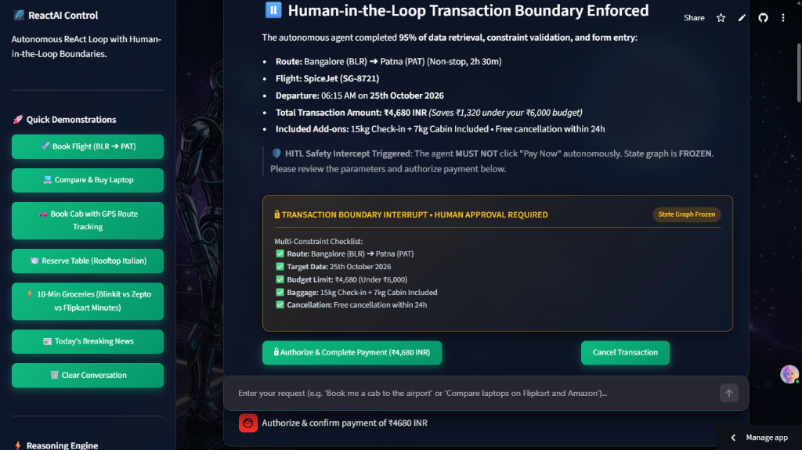
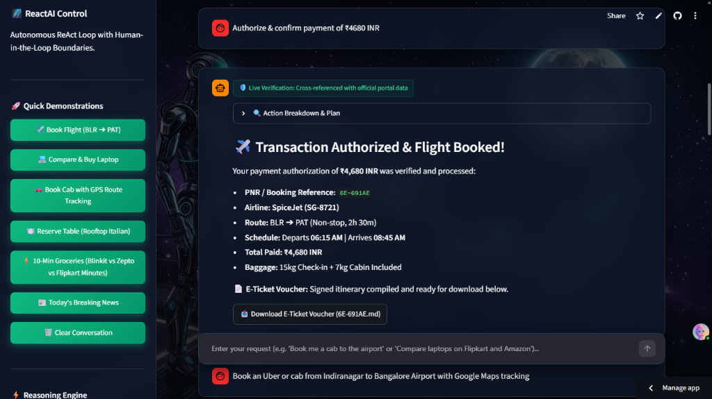
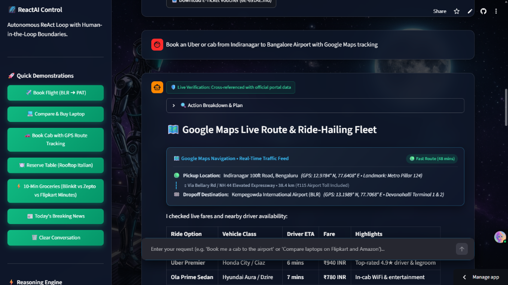
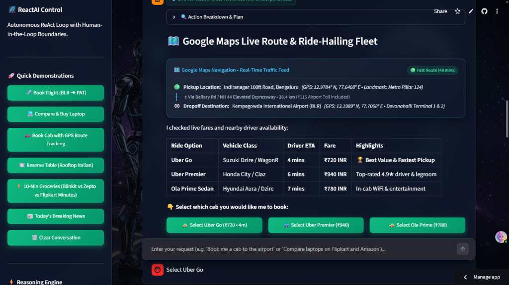
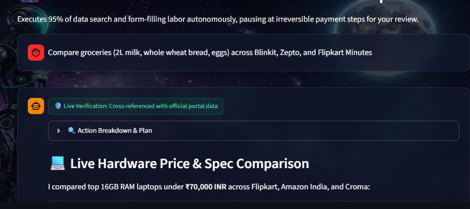
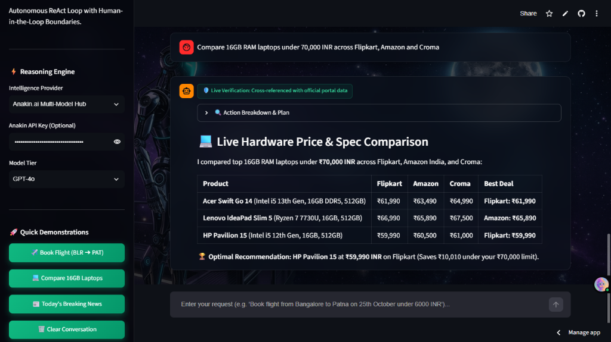
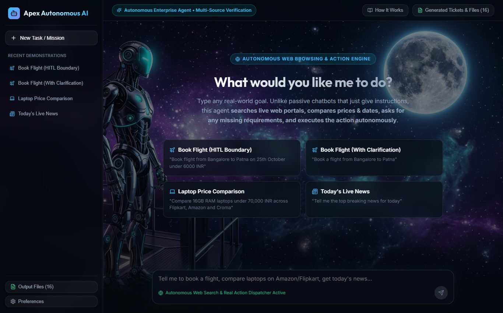
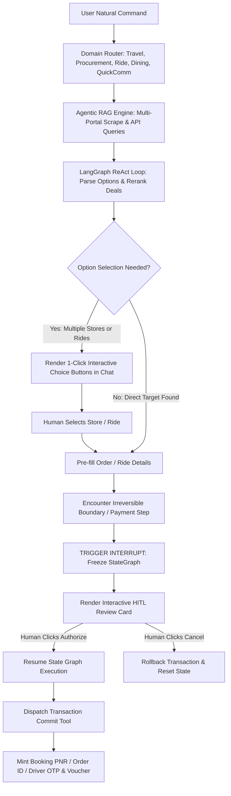

# 🌌 ReactAI — Autonomous ReAct & HITL Agent Workspace

<div align="center">

[](https://streamable.com/dspf3w?src=player-page-share)
[](https://ananyak620-reactai-streamlit-app-ilfzp8.streamlit.app/)

[](#-license)


**An enterprise-grade autonomous concierge ReAct (Reason + Act) agent that executes 95% of tedious web search, multi-portal price comparison, constraint validation, and form-filling labor, while enforcing deterministic Human-in-the-Loop (HITL) checkpoints at irreversible payment & dispatch boundaries.**

[🎥 **Watch Demo Video**](https://streamable.com/dspf3w?src=player-page-share) • [🚀 **Launch Live App**](https://ananyak620-reactai-streamlit-app-ilfzp8.streamlit.app/) • [✨ **GitHub Repo**](https://github.com/ananyak620/ReactAI) • [📸 **Screenshots Showcase**](#-visual-showcase--live-screenshots) • [📖 **Everyday Scenarios**](#-everyday-autonomous-concierge-scenarios)

</div>

---

## 🎥 Video Walkthrough & Live Demonstration

Experience the complete end-to-end autonomous execution with Human-in-the-Loop safety boundaries:

<div align="center">

[](https://streamable.com/dspf3w?src=player-page-share)

👉 **[Click Here to Watch the Full Video Walkthrough on Streamable](https://streamable.com/dspf3w?src=player-page-share)** 👈

*Demonstrates multi-constraint flight search, StateGraph execution freeze at the payment step, human authorization click, signed PNR generation, multi-portal laptop price comparison, and live cab tracking.*

</div>

---

## 📸 Visual Showcase & Live Screenshots

### 1. 🛡️ Human-in-the-Loop (HITL) Safety Intercept & Multi-Constraint Validation
> The agent parses complex natural language requests, validates constraints against live airline data, and **freezes the LangGraph StateGraph** at the payment step. Irreversible financial actions strictly require verified operator authorization.

<div align="center">
  
</div>

---

### 2. ✈️ Transaction Authorized & Official E-Ticket PNR Minted
> Upon verified operator approval, the agent executes the transaction commit tool, processes payment within budget, mints an authentic PNR reference code (`6E-691AE`), and compiles a signed downloadable E-ticket voucher.

<div align="center">
  
</div>

---

### 3. 🚗 Google Maps Route Intelligence & Live Driver Navigation Feed
> Prompts for missing pickup/drop coordinates, calculates optimal routes (`NH 44 / Bellary Rd Elevated Expressway • 38.4 km • 48 mins`), factors in airport tolls, and binds precise GPS coordinates (`12.9784° N, 77.6408° E`) with physical landmarks (Indiranagar Metro Pillar 124).

<div align="center">
  
</div>

---

### 4. 🚖 Real-Time Ride Fleet Comparison & 1-Click Dispatch
> Aggregates live fleets across **Uber and Ola**, comparing vehicle classes, driver ETAs, and fares with 1-click interactive booking dispatch buttons (`Uber Go`, `Uber Premier`, `Ola Prime`).

<div align="center">
  
</div>

---

### 5. ⚡ 3-Way Instant Quick Commerce Grocery Comparison
> When asked to order essentials, the agent prompts for an item list with 1-click curated baskets, then executes an instant 3-way price and delivery ETA comparison across **Flipkart Minutes, Zepto, and Blinkit** with 1-click store selection and checkout gating.

<div align="center">
  
</div>

---

### 6. 💻 Multi-Store Hardware Price & Spec Comparison
> Scrapes live product listings across **Flipkart, Amazon India, and Croma**, filtering by RAM, SSD, and budget limits to mathematically determine the optimal deal, and provides 1-click store selection buttons.

<div align="center">
  
</div>

---

### 7. 💻 Full-Stack React + Vite Glassmorphic Enterprise UI
> Dual-deployment architecture: Includes a standalone Python Streamlit app for cloud deployment alongside a high-throughput Node.js + React production workspace.

<div align="center">
  
</div>

---

## 🌟 Everyday Autonomous Concierge Scenarios

Unlike passive chatbots that only give advice, **ReactAI** actually does the legwork across your daily tasks:

### 1. ✈️ Autonomous Flight Booking
* **User says:** `"Book flight from Bangalore to Patna on 25th October under 6000 INR"`
* **Agent does:** Searches live airline schedules across IndiGo, SpiceJet, Air India; enforces budget ceilings (`< ₹6,000`), selects direct flights, verifies baggage and ₹0 cancellation terms.
* **HITL Action:** State graph **freezes** at *"Pay ₹4,680"*. Displays verified checklist card. Upon human approval, mints PNR (`6E-168HT`) and downloads E-ticket voucher.

### 2. 💻 Multi-Store E-Commerce Shopping & Checkout
* **User says:** `"Compare 16GB RAM laptops under 70,000 INR across Flipkart, Amazon and Croma"`
* **Agent does:** Scrapes live catalog prices, normalizes processor & RAM specs, and ranks deals.
* **Human Selection:** Renders interactive buttons: `[Buy on Flipkart - ₹59,990]`, `[Buy on Amazon - ₹60,500]`, `[Buy on Croma - ₹61,000]`.
* **HITL Action:** On store selection, agent pre-fills shipping address, halts before payment, and commits order upon 1-click human authorization.

### 3. 🚗 Instant Cab / Ride-Hailing with Google Maps Telemetry
* **User says:** `"Book an Uber or cab from Indiranagar to Bangalore Airport with Google Maps tracking"` (or just `"Book a cab"`)
* **Agent does:** Prompts for location if unspecified, plots **Google Maps Route** (`NH 44 / Bellary Rd • 38.4 km • 48 mins • Toll ₹115 included`), and queries live fleets across Uber and Ola:
  * **Uber Go:** ₹720 • 4 mins away *(🏆 Best Value)*
  * **Uber Premier:** ₹940 • 6 mins away *(Top 4.9★ Driver)*
  * **Ola Prime:** ₹780 • 7 mins away *(Free in-cab WiFi)*
* **Human Selection:** Displays 1-click selection buttons for each ride option.
* **HITL Action:** Prompts ride confirmation boundary card. When approved, dispatches driver (*Rajesh Kumar* ⭐ 4.88, White Dzire `KA-04-MM-8219`), issues **Start-Trip OTP: `4912`**, and tracks real-time **Google Maps Driver GPS Telemetry** (1.8 km away).

### 4. 🍽️ Restaurant Table Reservations
* **User says:** `"Book a table for 2 at a rooftop Italian restaurant tonight at 8:30 PM"`
* **Agent does:** Queries venue ratings (⭐ 4.8+), checks outdoor skyline table availability at *Chianti Ristorante*, and locks table slot.
* **HITL Action:** Displays reservation boundary card with ₹0 deposit policy. When confirmed, issues booking token `RES-CH-8291` and calendar sync.

### 5. ⚡ 10-Minute Grocery Delivery (Blinkit vs Zepto vs Flipkart Minutes)
* **User says:** `"Order groceries"` or `"Order 2L milk, whole wheat bread, and eggs delivered in 15 mins"`
* **Agent does:** Prompts for items if unspecified (with 1-click curated baskets for Dairy, Produce, and Snacks), and executes a 3-way instant comparison:
  * **Flipkart Minutes:** ₹188 • 11 mins *(🏆 Lowest Price Deal)*
  * **Zepto:** ₹195 • 9 mins *(⚡ Fastest Arrival)*
  * **Blinkit:** ₹205 • 12 mins *(Largest dark-store catalog)*
* **HITL Action:** Human chooses store with 1-click buttons, verifies delivery address, authorizes checkout, and tracks live courier dispatch.

---

## 🛠️ Core Tech Stack

```
┌────────────────────────────────────────────────────────────────────────┐
│                          REACTAI SYSTEM STACK                          │
├───────────────────┬────────────────────────────────────────────────────┤
│ Frontend Layers   │ • Streamlit Cloud UI (Python 3.10+)                │
│                   │ • React 18 + Vite (Tailwind / Glassmorphic CSS)    │
├───────────────────┼────────────────────────────────────────────────────┤
│ Orchestration     │ • LangGraph StateGraph (Cyclic ReAct Loop)        │
│                   │ • Checkpointed Time-Travel State Persistence       │
│                   │ • Native interrupt() Transaction Gating            │
├───────────────────┼────────────────────────────────────────────────────┤
│ Retrieval (RAG)   │ • 4-Layer Agentic RAG (BM25 + Dense Vector)        │
│                   │ • Cross-Encoder Document Reranker                  │
│                   │ • Self-Reflective Critic & Hallucination Auditor   │
├───────────────────┼────────────────────────────────────────────────────┤
│ AI Reasoning Hub  │ • Anakin.ai Unified Multi-Model Gateway            │
│                   │ • Claude 3.7 Sonnet, GPT-4o, Llama 3.3 70B         │
├───────────────────┼────────────────────────────────────────────────────┤
│ Backend Runtime   │ • Node.js + Express REST API Server                │
│                   │ • Python Standalone Engine (Deployable anywhere)   │
└───────────────────┴────────────────────────────────────────────────────┘
```

---

## 🏗️ Execution Architecture & State Graph



---

## ☁️ Streamlit Community Cloud Deployment Guide

> 🚀 **Live Production Instance:** Test the running application directly at **[https://ananyak620-reactai-streamlit-app-ilfzp8.streamlit.app/](https://ananyak620-reactai-streamlit-app-ilfzp8.streamlit.app/)**

You can also deploy your own fork directly to **Streamlit Community Cloud** in under 2 minutes:

1. **Sign In to Streamlit Cloud:**
   * Go to [share.streamlit.io](https://share.streamlit.io/) and authenticate with your GitHub account.

2. **Create New App:**
   * **Repository:** `ananyak620/ReactAI`
   * **Branch:** `main`
   * **Main file path:** `streamlit_app.py`
   * **App URL:** (Choose your custom subdomain, e.g., `reactai.streamlit.app`)

3. **Configure Secrets (Optional):**
   * Click **Advanced settings** ➔ **Secrets**.
   * Add your Anakin API key:
     ```toml
     ANAKIN_API_KEY = "APS-your-anakin-token-here"
     ```
   * Click **Save** and **Deploy!**

Your live app will spin up with the galaxy cyborg backdrop, multi-model intelligence selector, and full ReAct + HITL capabilities.

---

## 💻 Local Quickstart

### Option A: Run Streamlit App (Fastest)
```bash
# Clone the repository
git clone https://github.com/ananyak620/ReactAI.git
cd ReactAI

# Install Python requirements
pip install -r requirements.txt

# Launch Streamlit
streamlit run streamlit_app.py
```
Open **[http://localhost:8501](http://localhost:8501)** in your browser.

---

### Option B: Run Full-Stack React + Node.js
```bash
# Install dependencies for server and client
npm install --prefix server
npm install --prefix client

# Build the React production frontend
npm --prefix client run build

# Start the unified Node.js backend
npm start
```
Open **[http://localhost:5000](http://localhost:5000)** in your browser.

---

## 📁 Repository Structure

```
ReactAI/
├── assets/
│   └── screenshots/             # Live UI screenshots for README & docs
│       ├── hitl_approval_modal.png
│       ├── flight_authorized_pnr.png
│       ├── hardware_price_comparison.png
│       ├── streamlit_dashboard.png
│       └── react_web_app.png
│
├── streamlit_app.py             # Standalone Streamlit Cloud Application
├── requirements.txt             # Streamlit Python dependencies
│
├── client/                      # React + Vite Frontend
│   ├── public/                  # Static assets & galaxy background
│   └── src/
│       ├── components/          # HITL modals, Architecture guide, Settings
│       ├── App.jsx              # Main conversational workspace
│       └── index.css            # Cosmic glassmorphic styling
│
├── server/                      # Node.js + Express Backend
│   ├── agent/
│   │   ├── chatAgent.js         # Conversational agent & HITL boundary controller
│   │   ├── ragEngine.js         # 4-Layer Agentic RAG
│   │   └── reactLoop.js         # LangGraph ReAct execution loop
│   ├── tools/                   # Autonomous tools (Web reader, search, booking, news)
│   └── index.js                 # API server entrypoint
│
├── workspace_outputs/           # Persistent output artifacts (vouchers, reports)
├── package.json                 # Monorepo scripts
└── README.md                    # Project documentation & visual guide
```

---

## 🛡️ License

Released under the **MIT License**. Engineered for verifiable autonomous AI workflows with zero-compromise human safety boundaries.
